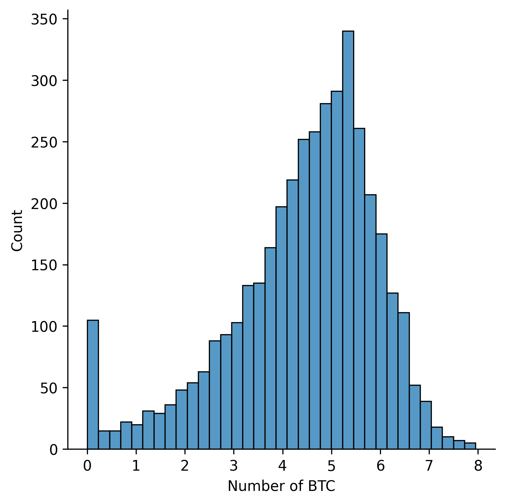
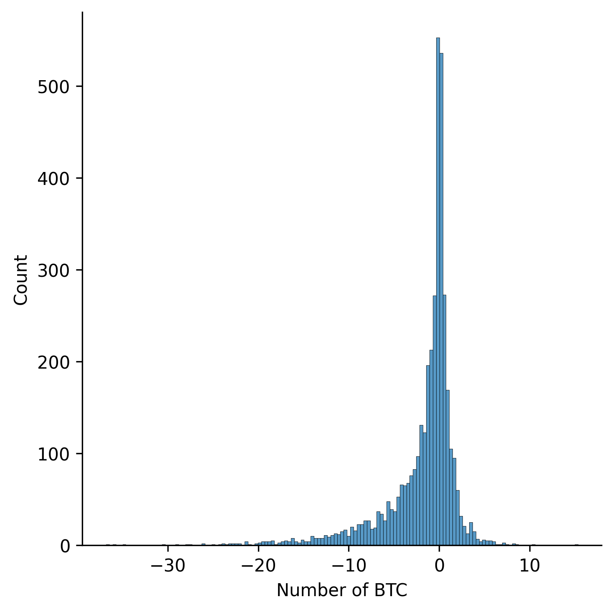
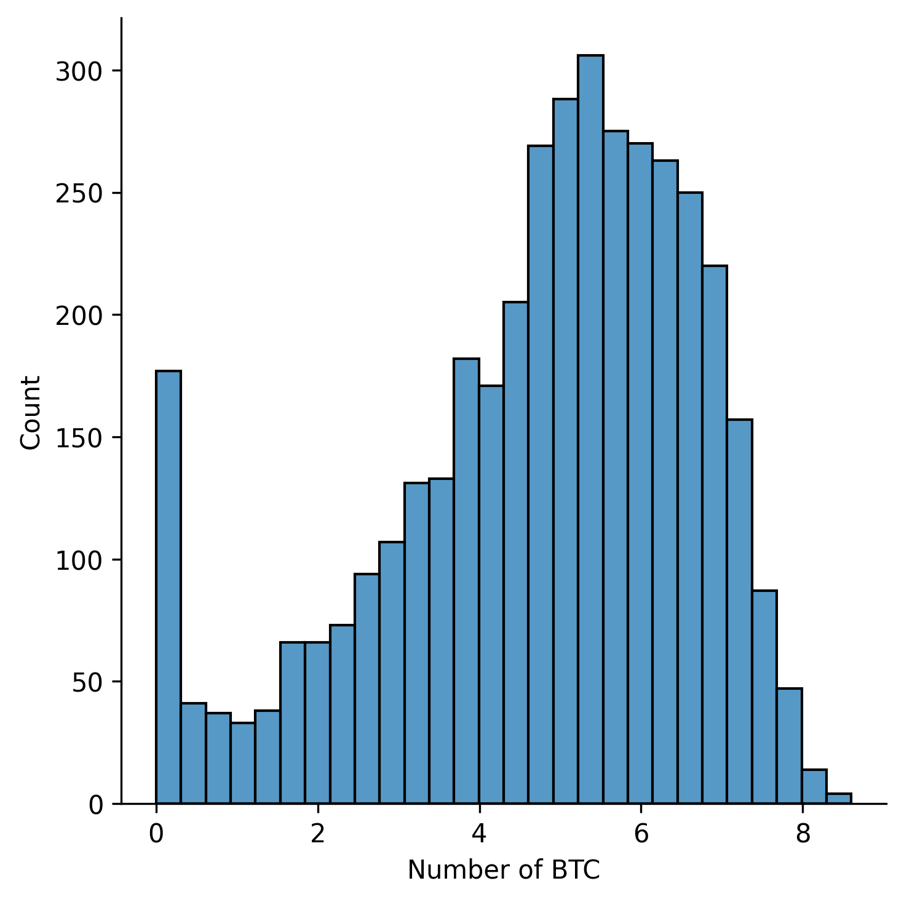
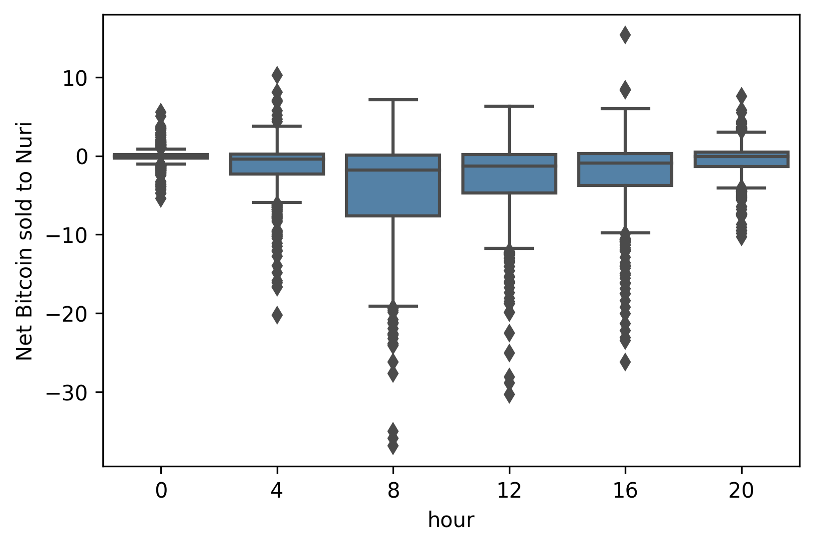
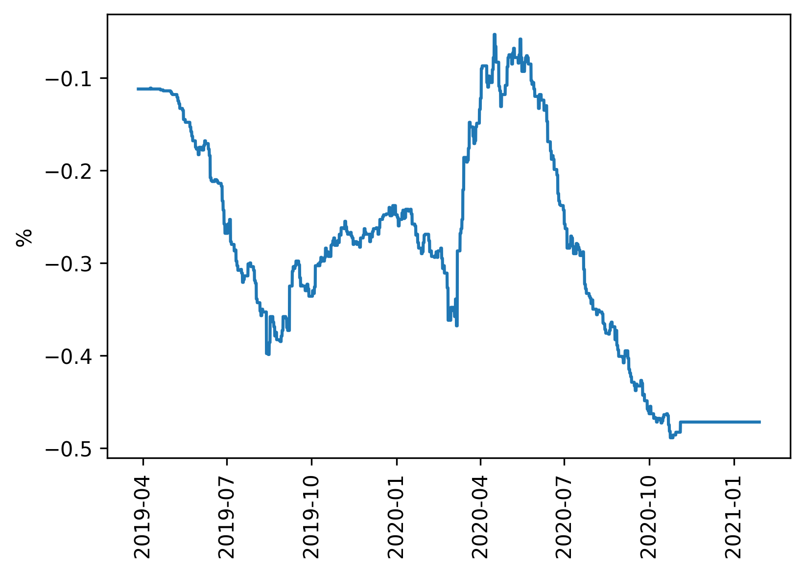
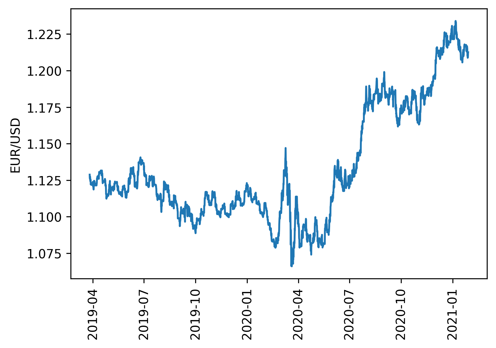
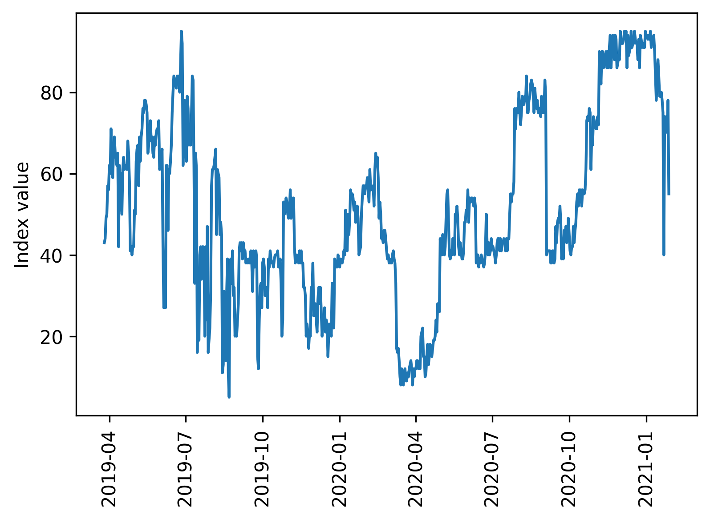
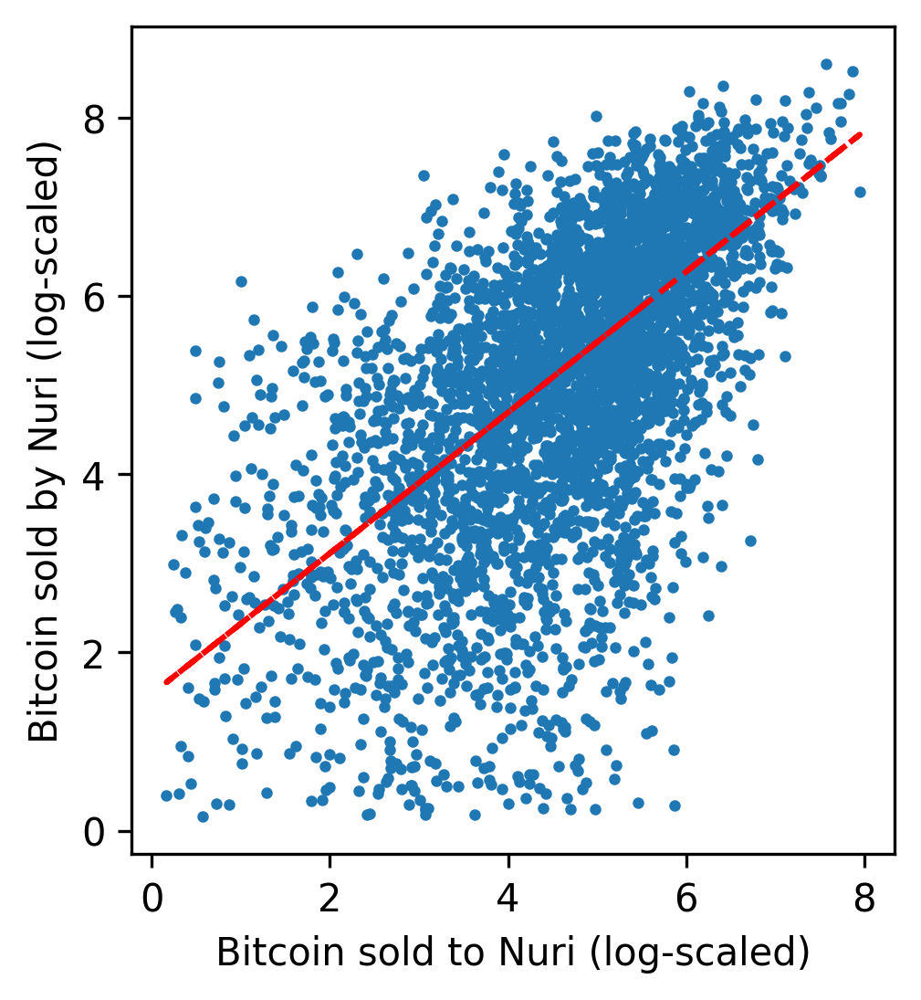
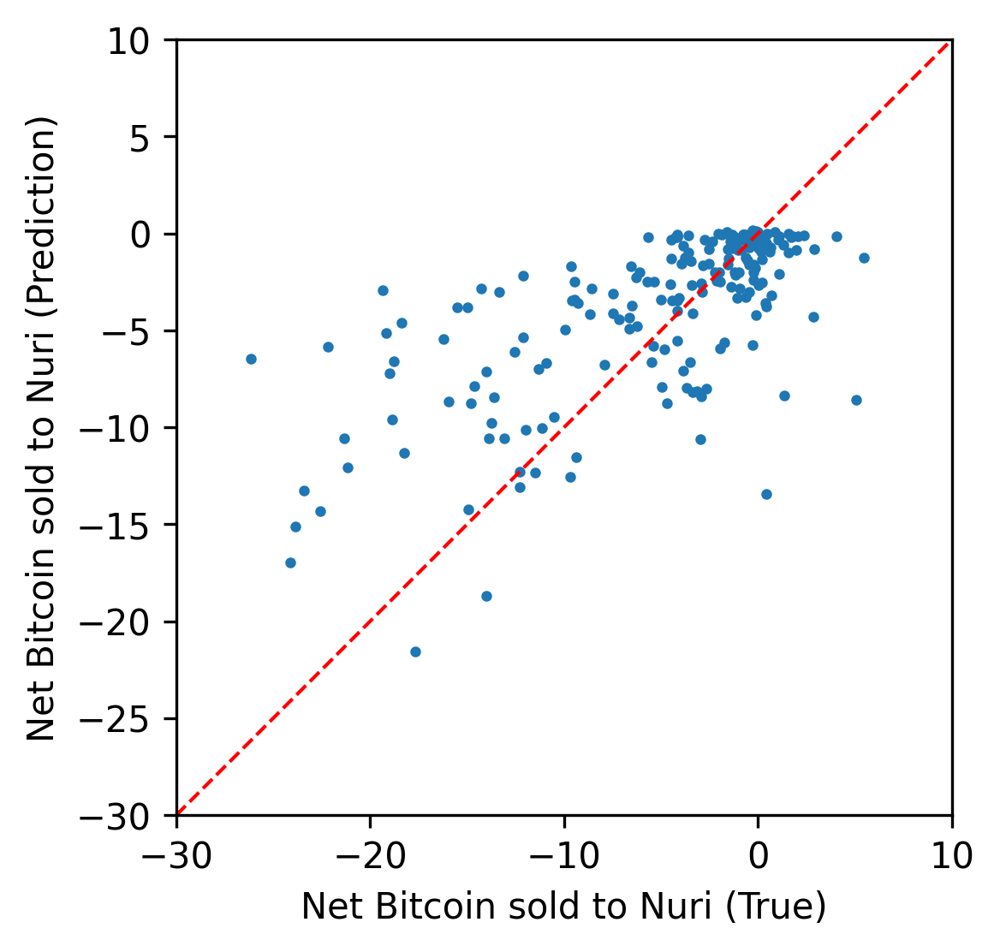
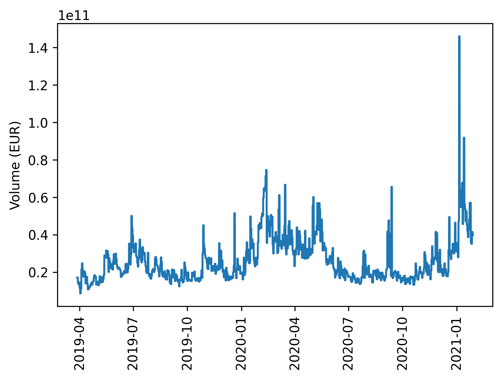

[](http://quantlet.de/)

## [](http://quantlet.de/) **CryptoVolumeForecasting-Data_visualization** [](http://quantlet.de/)

```yaml

Name of QuantLet: CryptoVolumeForecasting-Data_visualization

Published in: Cryptocurrency liquidity forecasting

Description: This Quantlet visualises the amount of Bitcoin bought and sold using histograms, box plots and scatterplots. Also visualizes input data, such as volume, FG index, EUR/USD exchange rate and EURIBOR.

Keywords: cryptocurrency, Bitcoin, visualization, histogram, scatterplot, box plot

Author: Ilyas Agakishiev

Submitted: Friday, 14 of July 2023 by Ilyas Agakishiev
```





















### PYTHON Code
```python

import seaborn as sns
import matplotlib.pyplot as plt
import numpy as np
import pandas as pd
from sklearn.linear_model import HuberRegressor

df = pd.read_csv("dataset_partial.csv", index_col=0)


df  = df.loc[df["BTC_buy"]!=0]
df  = df.loc[df["BTC_sell"]!=0]
df1 = df[-df["BTC_buy"]>=df["BTC_sell"]]

# Enable for diagonal cutoff
plt.scatter(-df["BTC_buy"],df["BTC_sell"],s=4, color="green")
plt.scatter(-df1["BTC_buy"],df1["BTC_sell"],s=4, color="red")
plt.plot([0.001,100],[0.001,100],"b--")

# Enable for regression
#huber = HuberRegressor(epsilon=1.0).fit(df["BTC_buy"].values.reshape(-1,1), df["BTC_sell"])
#p = np.poly1d([huber.coef_[0],huber.intercept_])
#plt.plot(df["BTC_buy"],p(df["BTC_buy"]),"r--")

plt.yscale('log')
plt.xscale('log')
plt.xlim([0.001,100])
plt.ylim([0.001,100])
plt.xlabel("Bitcoin sold to Nuri")
plt.ylabel("Bitcoin sold by Nuri")
plt.axis("square")
plt.savefig("Orders_scatter.png", dpi=300, transparent=True, bbox_inches="tight")
plt.show()

#########################################

df["hour"] = df["hour"].astype(int)
df["BTC_buy"]=-df["BTC_buy"]
sns.boxplot("hour","BTC_diff", data=df.sort_values("hour"), color="steelblue").set(ylabel="Net Bitcoin sold to Bitwala")
sns.boxplot("hour","BTC_buy", data=df.sort_values("hour"), color="steelblue").set(ylabel="Bitcoin sold by Bitwala")
sns.boxplot("hour","BTC_sells", data=df.sort_values("hour"), color="steelblue").set(ylabel="Bitcoin sold to Bitwala")

#########################################

df["BTC_diff_log"] = np.log(-df["BTC_diff"]+df["BTC_diff"].max()+1)
sns.distplot(df["BTC_buy"])

#########################################

df.index=pd.to_datetime(df.index)
plt.plot(df["volume_eur"])
plt.xticks(rotation=90)
plt.ylabel("Volume (EUR)")
plt.savefig("volume.png", dpi=300, transparent=True, bbox_inches="tight")
plt.show()


plt.plot(df["EURUSD"])
plt.xticks(rotation=90)
plt.ylabel("EUR/USD")
plt.savefig("EURUSD.png", dpi=300, transparent=True, bbox_inches="tight")
plt.show()


plt.plot(df["12_months"])
plt.xticks(rotation=90)
plt.ylabel("%")
plt.savefig("EURIBOR_12M.png", dpi=300, transparent=True, bbox_inches="tight")
plt.show()


fg = pd.read_csv("FGIndex.csv", index_col=0)
fg=fg.iloc[28:-115]
fg.index=pd.to_datetime(fg.index, dayfirst=True)

plt.plot(fg["FGI"])
plt.xticks(rotation=90)
plt.ylabel("Index value")
plt.savefig("FGI.png", dpi=300, transparent=True, bbox_inches="tight")
plt.show()

```

automatically created on 2023-07-22