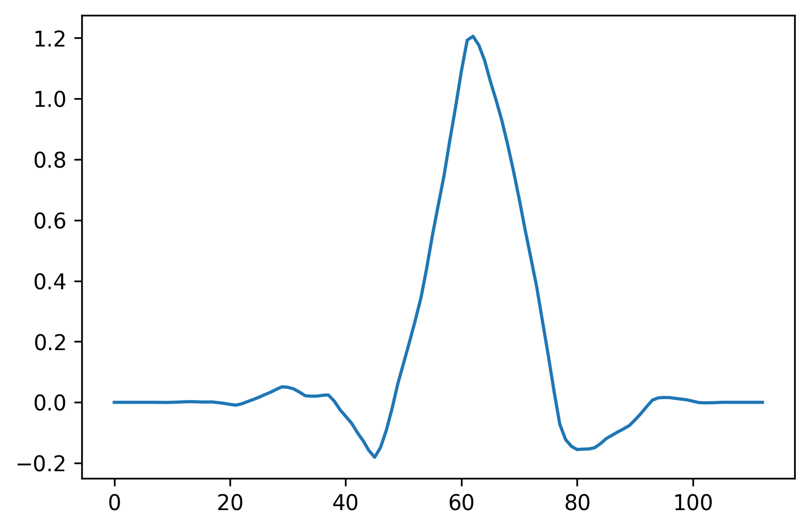
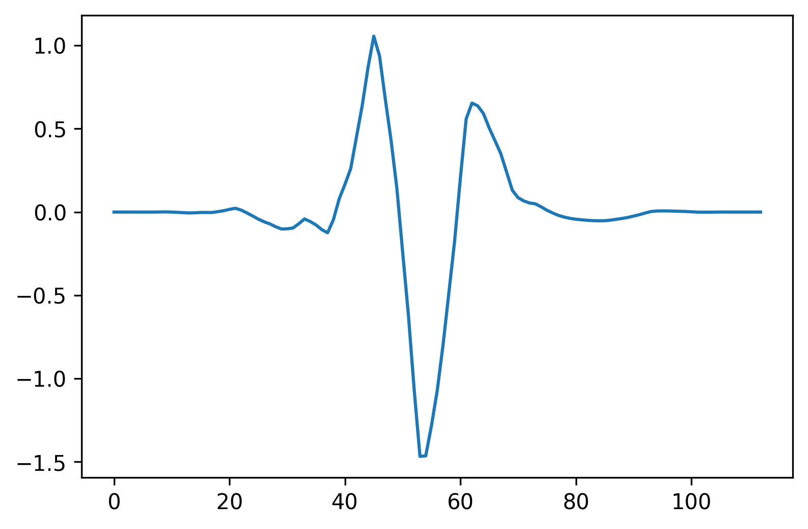

[](http://quantlet.de/)

## [](http://quantlet.de/) **CryptoVolumeForecasting-Symlet** [](http://quantlet.de/)

```yaml

Name of QuantLet: CryptoVolumeForecasting-Symlet

Published in: Cryptocurrency liquidity forecasting

Description: This Quantlet visualises the symlet-4 father and mother wavelets.

Keywords: symlet, wavelet, preprocessing, visualisation

Author: Ilyas Agakishiev

Submitted: Friday, 14 of July 2023 by Ilyas Agakishiev
```



