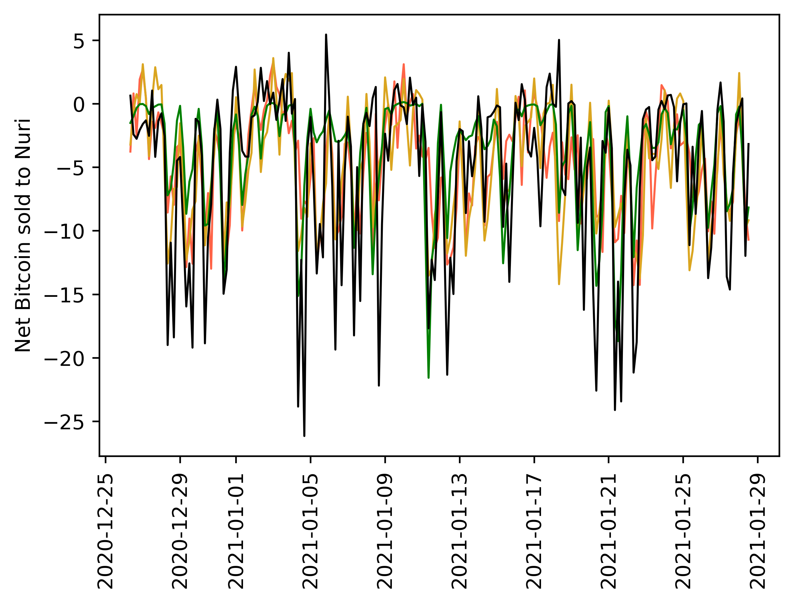
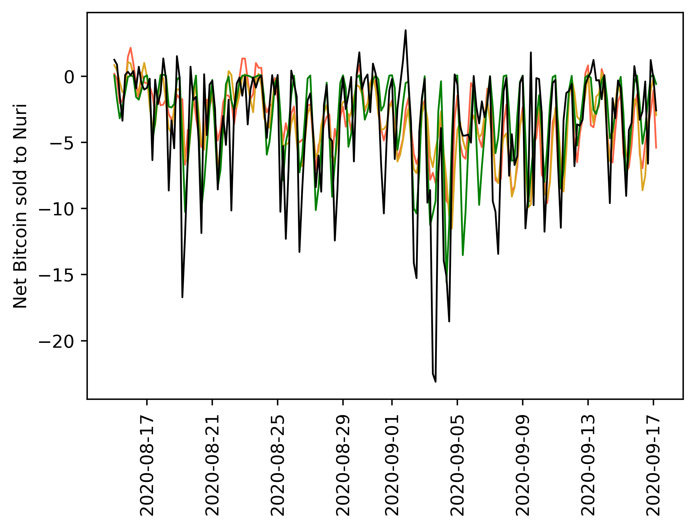
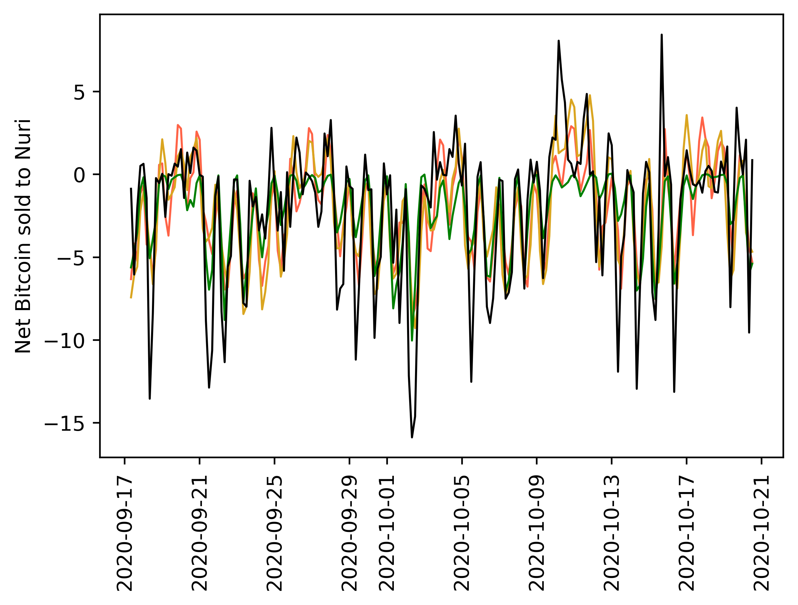
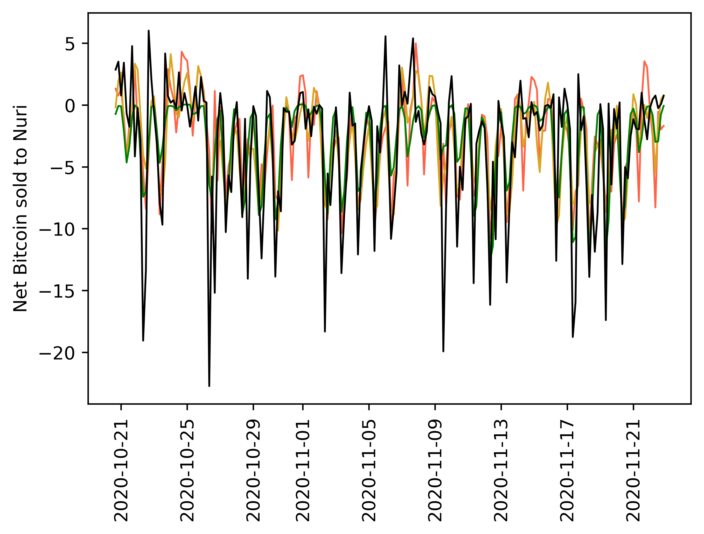
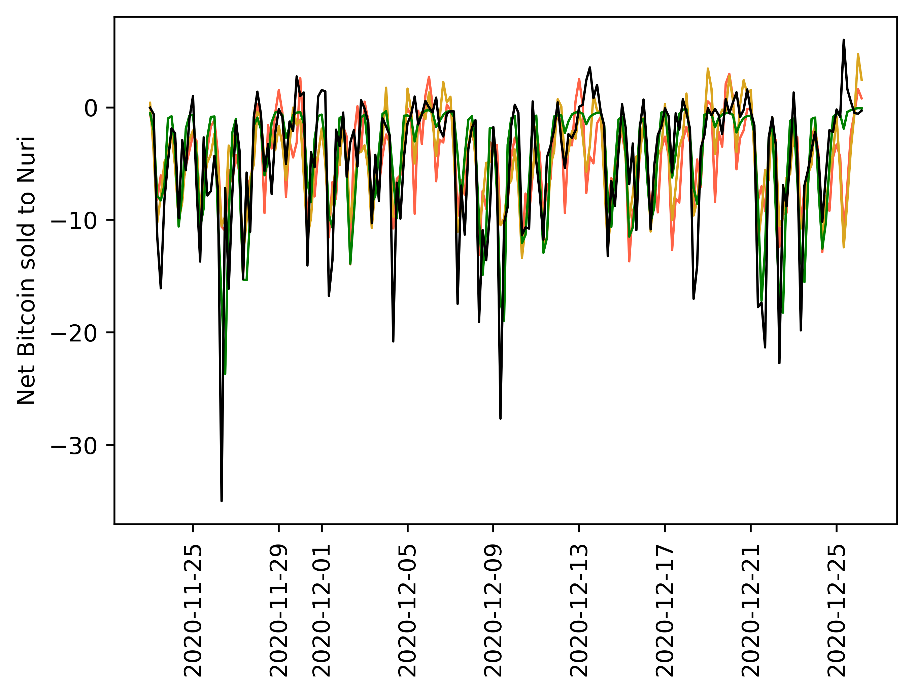

[](http://quantlet.de/)

## [](http://quantlet.de/) **CryptoVolumeForecasting-Validation_test_plot** [](http://quantlet.de/)

```yaml

Name of QuantLet: CryptoVolumeForecasting-Validation_test_plot

Published in: Cryptocurrency liquidity forecasting

Description: This Quantlet visualizes the market liquidity prediction for various methods and different time periods.

Keywords: cryptocurrency, Bitcoin, visualization, LSTM, TBATS, SARIMAX

Author: Ilyas Agakishiev

Submitted: Friday, 14 of July 2023 by Ilyas Agakishiev

```











### PYTHON Code
```python

import pandas as pd
import matplotlib.pyplot as plt

df       = pd.read_csv(r"\Results_comparison.csv", index_col=0)
df.index = pd.to_datetime(df.index, dayfirst=True)
start    = 800 # Change this value for different periods
stop     = start+200

fig = plt.figure()
ax  = fig.add_subplot(111)

ax.set_ylabel("Net Bitcoin sold to Bitwala")

plt.plot(df["SARIMA"].iloc[start:stop], linewidth=1, color="tomato")
plt.plot(df["TBATS"].iloc[start:stop], linewidth=1, color="steelblue")
plt.plot(df["LSTM"].iloc[start:stop], linewidth=1, color="green")
plt.plot(df["TS"].iloc[start:stop], linewidth=1, color="black")
plt.show()

```

automatically created on 2023-07-22